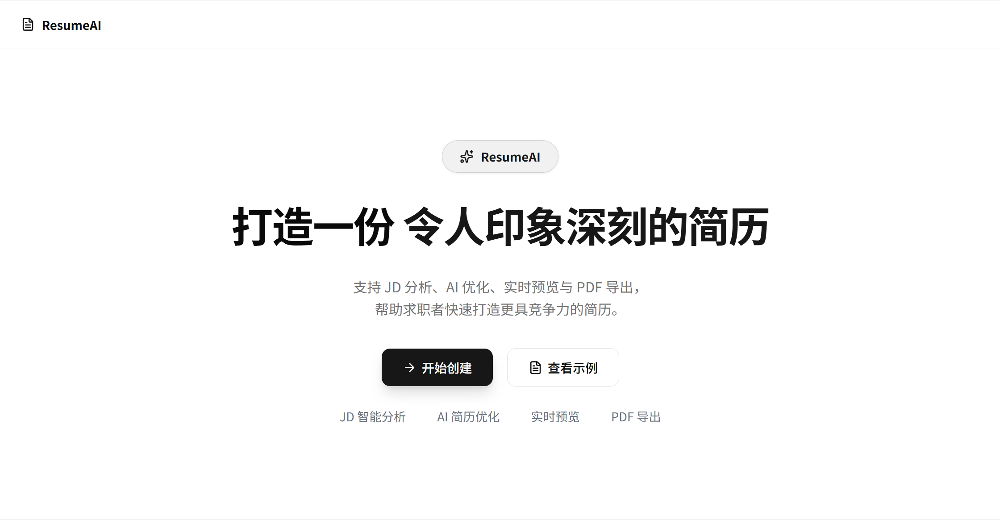
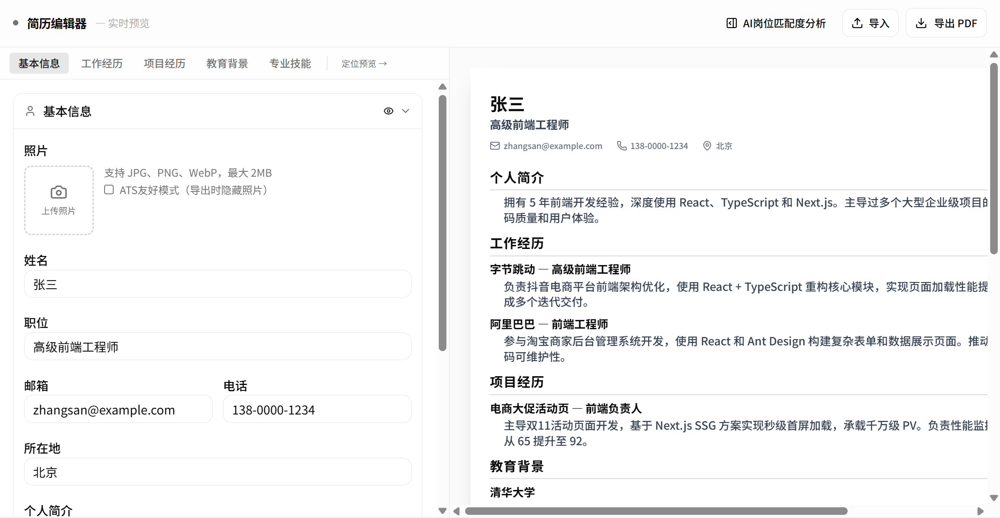
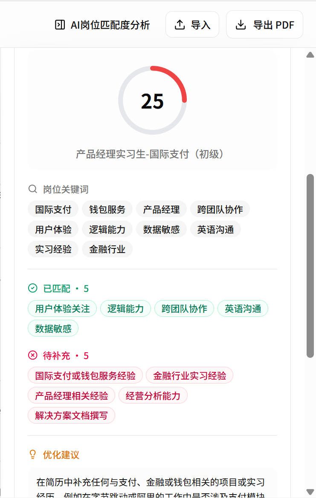
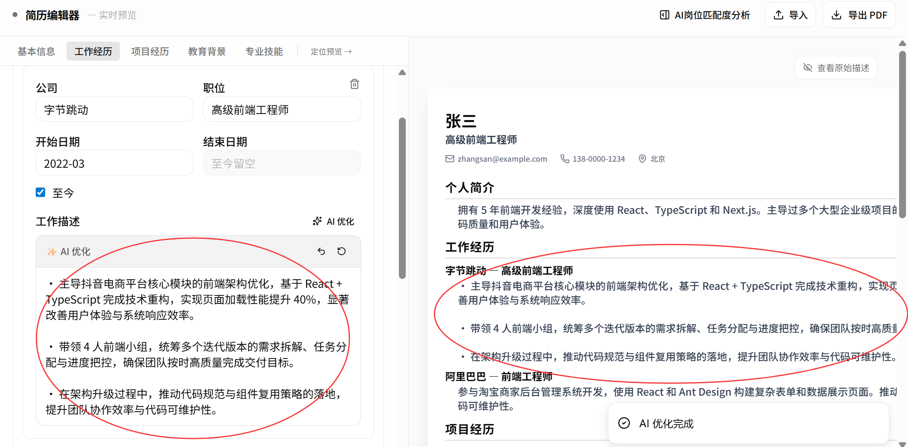
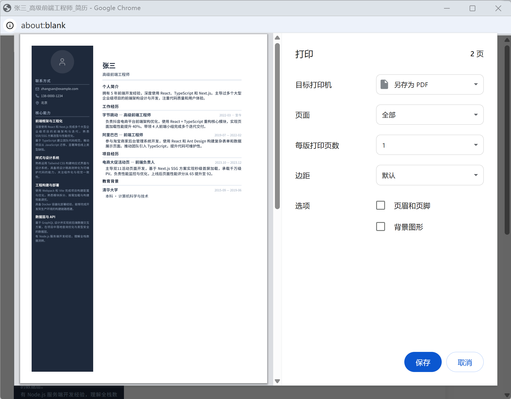

# ResumeAI

AI 智能简历编辑器，帮助求职者快速完成简历编辑、岗位匹配分析与 AI 优化。

支持 JD 分析、AI 优化、实时预览与 PDF 导出，让简历制作更高效、更结构化。


## 🚀 Online Demo

Try it here:  
👉 https://ai-resume-copilot-xi.vercel.app

---

## 项目简介

在海投求职过程中，我发现针对不同岗位频繁修改简历是一件非常耗时的事情：

* 不知道 JD 真正关注什么
* 不知道如何提炼自己的经历
* 同一份简历需要反复修改
* AI 工具生成内容容易空洞、不真实

因此开发了 ResumeAI，希望通过 AI 辅助完成：

* 简历导入与编辑
* JD 岗位分析
* 简历匹配度评估
* AI 内容优化
* PDF 导出

帮助用户更高效地完成简历定制。

---

## 项目预览

### 首页



### 简历编辑器



### JD 岗位匹配分析



### AI 简历优化



### PDF 导出



---

## 核心功能

### 简历编辑

支持：

* 基本信息
* 工作经历
* 项目经历
* 教育背景
* 专业技能

实时编辑与预览。

---

### AI 岗位匹配分析

输入目标 JD 后：

* 提取岗位关键词
* 分析能力要求
* 输出匹配度分析
* 识别优势与缺口

帮助用户快速了解岗位要求。

---

### AI 简历优化

支持针对：

* 工作经历
* 项目经历
* 技能描述

进行 AI 优化。

优化原则：

* 保持真实性
* 提升表达质量
* 强化关键词匹配
* 避免过度包装

---

### 多模板简历

当前支持：

* 简约风
* 商务风
* 科技风
* 创意风

一键切换模板。

---

### PDF 导出

支持：

* A4 排版
* 多页导出
* 自动分页
* 打印友好

---

### 简历导入

支持：

* DOCX
* TXT

自动解析并填充简历内容。

---

### 自定义 AI 配置

支持用户自行配置：

* DeepSeek
* OpenAI
* OpenRouter

API Key 仅保存在本地浏览器。

不会上传至开发者服务器。

---

## 技术栈

### 前端

* Next.js 15
* React
* TypeScript
* Tailwind CSS

### AI

* DeepSeek API
* OpenAI API
* OpenRouter

### 文件处理

* Mammoth
* DOCX Parser

### PDF

* Browser Print
* Print CSS

---

## 快速开始

### 1. 克隆项目

```bash
git clone https://github.com/Persistloner/resume-ai.git
cd resume-ai
```

### 2. 安装依赖

```bash
npm install
```

### 3. 启动项目

```bash
npm run dev
```

访问：

```text
http://localhost:3000
```

---

## API 配置

首次使用需要配置模型接口。

进入：

```text
模型配置
```

选择：

* DeepSeek
* OpenAI
* OpenRouter

填写自己的 API Key 即可使用。

说明：

* API Key 保存在本地浏览器
* 不上传服务器
* 不会被开发者获取

---

## 产品设计原则

ResumeAI 不追求“夸大经历”。

核心原则：

* 保持真实性
* 强化表达
* 提升匹配度
* 辅助用户思考

AI 应该帮助用户表达能力，而不是伪造能力。

---

## Roadmap

### 已完成

* [x] 简历编辑
* [x] DOCX/TXT 导入
* [x] AI 岗位分析
* [x] AI 简历优化
* [x] 多模板切换
* [x] PDF 导出
* [x] 自定义 API Key

### 计划中

* [ ] 简历版本管理
* [ ] 更多简历模板
* [ ] 多语言简历
* [ ] 面试问题生成
* [ ] 求职数据分析

---

## 开源协议

MIT License

---

## 作者

Marvin

AI Product Manager Learner

如果这个项目对你有帮助，欢迎 Star ⭐
